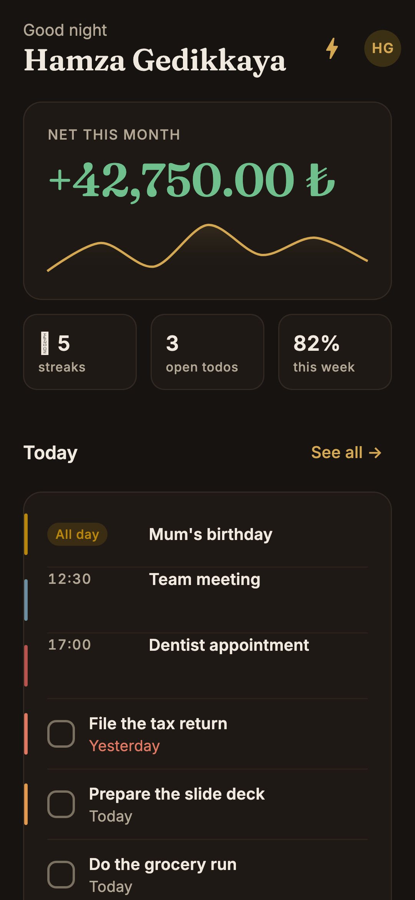
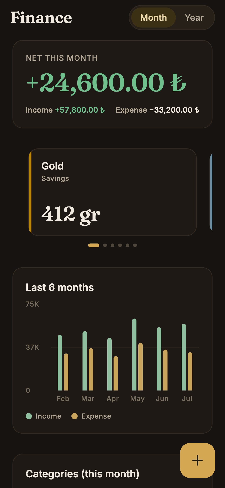
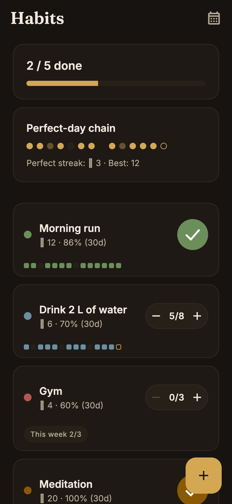
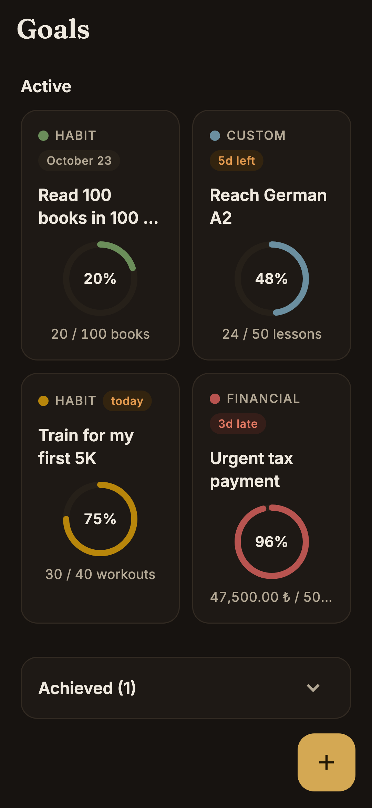
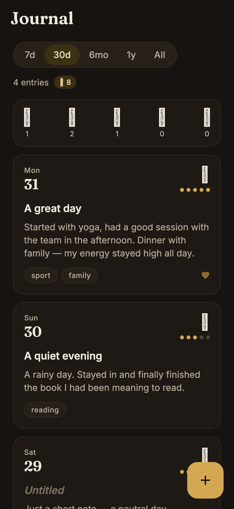
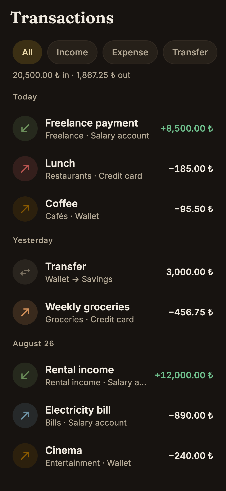
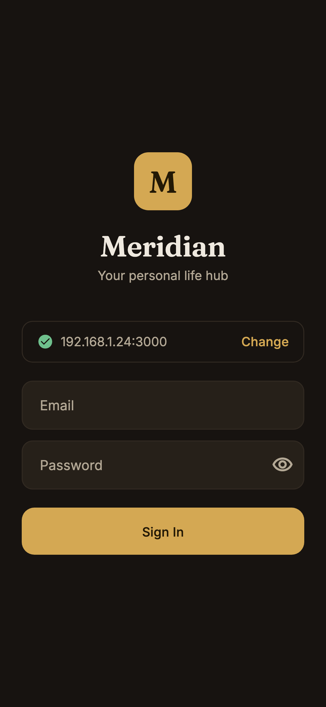
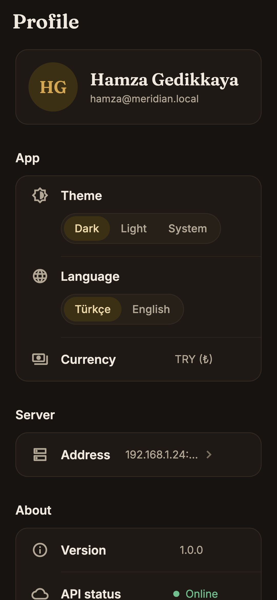

<p align="center"><sub><b>English</b> · <a href="README.tr.md">Türkçe</a></sub></p>

<h1 align="center">
  
  &nbsp;Meridian Mobile
</h1>

<p align="center"><i>Your life, beautifully organized — now in your pocket.</i></p>

<p align="center">
  
  
  
  
  
  <a href="https://github.com/hamzagedikkaya/meridian"></a>
  <a href="LICENSE"></a>
</p>

<p align="center">
  <a href="#-highlights">Highlights</a> ·
  <a href="#-quick-start">Quick start</a> ·
  <a href="#-architecture">Architecture</a> ·
  <a href="#-design-system">Design</a> ·
  <a href="#-api-surface">API</a> ·
  <a href="#-tests">Tests</a>
</p>

---

Meridian Mobile is the Flutter client for [**Meridian**](https://github.com/hamzagedikkaya/meridian) — the self-hosted, local-first personal life OS. It talks to *your* Rails server over *your* Wi-Fi: no cloud tenant, no third-party analytics, no account to create. Point the app at `http://192.168.1.20:3000`, sign in, and your money, habits, goals and journal are on your phone.

Android-first, dark by default, fully bilingual — every screen speaks **Turkish and English**, switchable from the app and remembered on your account. Every number is rendered from integer cents with the right subunit per currency, in the notation the language expects.

<p align="center">
  
  
  
  
</p>

<p align="center"><sub>Real renders from the golden harness — bundled fonts, realistic fixtures, phone metrics (360×780 @3x). <a href="#-tests">See Tests</a>.</sub></p>

## ✨ Highlights

Five tabs, one per domain — plus a pushed profile stack.

### ☀️ Today — the day, in one scroll
Time-aware greeting over the month's net in Fraunces display numerals, with a 7-day spending sparkline underneath. Three stat chips (streaks · open todos · weekly habit rate) that deep-link into their own tab. Today's events and due todos share one card — priority shows as a quiet 3dp edge bar, overdue dates turn red, and checking a todo animates instantly and reconciles with the server afterwards. Below that: today's habits with tap-to-complete rings, and the top three goals with paced progress bars. The ⚡ icon opens **quick capture** — one field that routes `−250 coffee` to a transaction, `habit: run` to a habit log, and anything else to a todo. Overdue todos surface as a red count badge on the tab itself.

### 💰 Finance — money without the spreadsheet
Month/year segmented hero with the income–expense split. Accounts are a snapping card carousel, each rendered in its own currency (`412 gr` for gram-gold, `1.234,56 ₺` for lira) with a Hero flight into account detail. Then a six-month grouped income/expense bar chart, a category donut with tap-to-drill-down breakdown sheet, and budget rows with a **pace tick** — the vertical mark showing where you *should* be today — plus a month-end projection line when you're outrunning the budget. Upcoming subscriptions and recent transactions close the screen.

**Transactions** is the full feed: sticky filter chips (kind · account · category · date range), day-grouped headers (`Today` / `Yesterday` / `12 July`), infinite scroll, swipe-left-to-delete with confirmation, and a detail sheet with edit/delete. Creating a transaction is **amount-first**: a giant serif figure driven by a custom 4×3 keypad, then account, category, date, description — with the decimal key hidden for gram-gold accounts.

### 🔥 Habits — streaks that mean something
A "2 / 5 done" progress bar, a 30-dot **perfect-day chain**, then one card per habit: streak, 30-day completion rate, a 14-day chain strip, and either a tap ring (single) or a `− 5/8 +` counter pill (multi-count). Toggles apply optimistically and roll back with a snackbar if the server disagrees. Completing the last habit of the day fires the app's only confetti burst — 12 hand-painted particles, once. Habit detail adds an 84-day heatmap and archive.

### 🎯 Goals — progress you can see
Two-column cards with animated progress rings, a type overline (`FINANCIAL` / `HABIT` / `CUSTOM`) and colour-coded deadline badges (`3d late`, `today`, `5d left`). Achieved goals collapse into their own section. Detail flies the ring in as a Hero and shows the right panel for the type: a `−10 −1 +1 +10` stepper for custom goals, the linked streak and day count for habit-linked ones, and recalculate-from-balance for financial ones.

### 📓 Journal — a calm place to write
Range pill (7d / 30d / 6mo / 1y / All), a mood distribution strip you can **tap to filter**, then Day One-style entry cards: date block in Fraunces, mood emoji, energy as five dots, tag pills, and a gratitude marker. Detail renders the server's rich text. The editor opens with a mood check-in, autofocuses the body, and autosaves a draft every 5 seconds.

### 👤 Profile — yours, and the server's
Theme (dark / light / system), **language (Türkçe / English)**, currency, live API status, app version — and a dedicated **server page** that pings `/health` and reports `✓ Connected · Meridian v1.0.0 · 38 ms`. Saving an unreachable URL asks for confirmation. Logout wipes the token and the account state, keeping only the server address, language and theme so the login screen still looks like yours.

<p align="center">
  
  
  
  
</p>

<p align="center"><sub>Journal · Transactions · Login · Profile</sub></p>

### Cross-cutting behaviour
| | |
|---|---|
| **Bilingual, end to end** | Two typed string sets (`lib/l10n/`), an abstract contract the analyzer enforces, and a switch in Profile that re-renders the app immediately. The choice is stored on the device *and* pushed to the account, so the web app and a reinstall follow. Turkish is the default; the phone's language is used on first run when it is one of the two. |
| **Language-correct numbers** | `%82` in Turkish, `82%` in English. `1.234,56 ₺` vs `1,234.56 ₺`. `75B` vs `75K` on chart axes. `27 Ağustos` vs `August 27`. One `Intl.defaultLocale`, kept in sync by the localization delegate. |
| **Offline honesty** | A failed refresh keeps the last good data on screen under a hairline banner — `Offline · last updated 12:40` with retry. The full-screen error state appears only when there is nothing cached to show. |
| **Optimistic writes** | Checks, counters and deletes update the UI first, then reconcile; failures roll back with an error snackbar. |
| **Skeletons, not spinners** | Every screen has a bone layout that mirrors its real geometry, cross-fading into content. No blocking dialogs anywhere. |
| **Money in one place** | Integer `*_cents` + per-currency `subunit_to_unit`, formatted by a single function. Gram-gold (`GAU`) has a subunit of 1, so it renders `412 gr` — never `4,12`. |
| **Signs, not just colours** | `+` for income in green, `−` for expense in default ink. Never colour-only — a wall of red is alarming, and colour alone fails for colour-blind users. |
| **Errors carry a reason, not a sentence** | The API layer raises a typed `ApiErrorKind`; the UI turns it into copy in the active language. Server-side validation messages are shown as-is — Rails already localizes them per user. |
| **Haptics** | A four-level map: tick on selection, light on success, medium on celebration, heavy on destructive confirm. Silent no-ops on web. |

## 🧰 Tech Stack

| Layer | Choice |
|---|---|
| Framework | Flutter 3.44 · Dart 3.12 (Material 3) |
| State | `flutter_riverpod` ^3.3.2 — no codegen; `AsyncValue` with last-good retention |
| Routing | `go_router` ^17.3.0 — `StatefulShellRoute.indexedStack`, 5 branches, root-level modal routes |
| Networking | `dio` ^5.10.0 — Bearer interceptor, `401` → sign-out, errors normalised to one `ApiException` |
| Localization | typed string classes + a `LocalizationsDelegate` (no `.arb`, no codegen) · `flutter_localizations` |
| Storage | `flutter_secure_storage` ^10.3.1 (token) · `shared_preferences` ^2.5.5 (server URL, language, theme, drafts) |
| Charts | `fl_chart` ^1.2.0 — donut, sparkline, grouped six-month bars |
| Motion | `animations` ^2.2.0 (fade-through) · `flutter_animate` ^4.5.2 (entrance staggers only) |
| Loading | `skeletonizer` ^2.1.3 |
| Rich text | `flutter_widget_from_html_core` ^0.17.2 — journal `body_html` |
| Formatting | `intl` ^0.20.2 — money, dates and month names per locale |
| Type | Fraunces + Inter bundled as `.ttf` under `assets/fonts/` — no runtime font fetch |
| Quality | `flutter_lints` ^6.0.0 · `flutter_test` · `matchesGoldenFile` |

## 🚀 Quick Start

**Requirements** — Flutter 3.44+ stable (Dart 3.12+), Android SDK with API 26+ for a device build, and a running [Meridian](https://github.com/hamzagedikkaya/meridian) server exposing `/api/v1`.

```bash
git clone https://github.com/hamzagedikkaya/meridian-mobile.git
cd meridian-mobile
flutter pub get
flutter run                 # Android device or emulator
```

For the layout/data preview in the browser:

```bash
flutter run -d chrome --web-browser-flag=--disable-web-security
```

> The Meridian server ships no CORS middleware, so the browser preview needs that flag (or a dev-only `rack-cors`). Native builds are unaffected.

### Connecting to your server

The address field on the login screen prefills sensibly and remembers your last choice:

| Where you run it | Prefilled address |
|---|---|
| Chrome (web preview) | `http://localhost:3000` |
| Android emulator | `http://10.0.2.2:3000` |
| Physical device | last used — enter your machine's LAN IP, e.g. `http://192.168.1.20:3000` |

Type the address, wait for the ✓, then sign in with any Meridian user — the server's seeds create `demo@meridian.local` / `demo12345`. The credentials section stays dimmed until the health ping succeeds, so a wrong address can never look like a wrong password.

Cleartext `http://` to a LAN server is enabled through `network_security_config.xml` in the **debug** manifest; a release APK needs that config promoted to the main manifest (or HTTPS).

### Everyday commands

```bash
flutter analyze                                          # static analysis — currently clean
flutter test                                             # unit + widget suites
flutter test --run-skipped test/golden                   # compare the screenshots
flutter test --run-skipped --update-goldens test/golden  # refresh both sets
flutter build apk --release                              # sideloadable APK
```

## 🧱 Architecture

```
lib/
├─ main.dart          ProviderScope + MaterialApp.router, all intl locales loaded
├─ core/              api.dart          dio factory, Bearer interceptor, ApiErrorKind
│                     session.dart      token store, server URL, auth state machine, /health
│                     locale_mode.dart  UI language: device choice → account → phone → tr
│                     theme_mode.dart   dark/light/system, resolved the same way
│                     formats.dart      money, dates, decimals — value shaping only
│                     haptics.dart      the four-level haptics map
├─ l10n/              app_l10n.dart     the abstract contract + delegate + context.l10n
│                     app_l10n_tr.dart · app_l10n_en.dart   one class per language
├─ models/            immutable models, fromJson only — one file per domain
├─ data/              repository.dart   one async method per endpoint
│                     providers.dart    Riverpod providers → AsyncValue<Fetched<T>>
├─ theme/             app_colors.dart   Noktürn tokens as a ThemeExtension (dark + light)
│                     app_typography.dart · app_theme.dart
├─ router/            app_router.dart   shell branches, auth redirect, fade-through pages
└─ ui/
   ├─ widgets/        two dozen shared pieces: NokturnCard, NokturnRow, MoneyText,
   │                  ProgressRing, PacedProgressBar, AmountKeypad, PickerSheet…
   └─ screens/        today · finance · habits · goals · journal · profile · shell
                      (+ login, splash) — each with its own widgets/ folder
```

Routes mirror the folders — `/today`, `/finance`, `/finance/transactions`, `/habits`, `/goals/:id`, `/journal/:id`, `/profile/server` — so the code stays in one language while the UI speaks two.

**Localization.** `AppL10n` is an abstract class with one member per string; `AppL10nTr` and `AppL10nEn` implement it. A new string that is only written in one language does not compile, which is the whole point — there is no runtime fallback to silently hide a gap. API values (`mood`, `account_type`, `frequency`) are mapped by small `switch` methods rather than stored copy, and the delegate keeps `Intl.defaultLocale` in step so `core/formats.dart` shapes numbers and dates for the active language without threading a locale through the tree.

**The read path.** A screen watches a provider, which asks the repository, which calls dio. Providers return `Fetched<T>` — the data plus the timestamp it arrived — and Riverpod 3 keeps the previous value through a failed refresh. So the render rule is uniform everywhere: draw `.value` if it exists, add the offline banner when `hasValue && hasError`, and show a full empty state only when there is nothing at all. The cache is per session and in memory; nothing is persisted to disk.

**The write path.** Screens call the repository directly, update local state optimistically where it makes the interaction feel instant, then invalidate the affected provider. The transactions feed is an `AsyncNotifier` keyed by an immutable `TxFilters` record, so the feed and account detail can paginate side by side without sharing state — and a delete adjusts the running totals locally instead of resetting the feed.

**Auth.** The splash gate reads the token, routes optimistically, and probes `/me` in the background; a `401` from anywhere trips the dio interceptor, wipes the token and ejects to login with a notice. `go_router`'s redirect is driven by a three-state session machine (`unknown` → `loggedOut` / `loggedIn`), so there is exactly one place that decides where you land.

## 🎨 Design System

The visual language is **Noktürn** — warm-dark private banking crossed with Day One. Deep espresso blacks (never pure `#000`), one disciplined gold reserved for emphasis and primary actions, serif display type for hero numbers. Full specification, including every token and screen: [`docs/design.md`](docs/design.md).

<p align="center">
  
  
  
  
  
  
  
</p>

- **Colour** — 26 named tokens per theme, exposed as a `ThemeExtension` and read with `context.nok`. Gold never means good or bad; it means *yours*. Green and red stay strictly semantic, which is what keeps the gold precious.
- **Elevation** — surface steps plus 1dp hairlines, never shadows. `bg` → `surface1` (cards) → `surface2` (nav, inputs, chips) → `surface3` (sheets, dialogs).
- **Type** — Fraunces 600 for display and headings, Inter for everything else. All amounts use tabular figures so columns never wobble in either language.
- **Motion** — 350ms `easeOutCubic` by default, no springs. Fade-through between tabs, 400ms slide-up for create/edit modals, exactly two Hero flights in the whole app, and one deliberate overshoot: the check-off pop. Hero numbers count up on first load and cross-fade on refresh — a refresh that re-animates its numbers is lying about what changed.
- **Light theme** — a full second palette on warm paper, with gold darkened to `#96731D` to hold AA contrast.

## 🔌 API Surface

All endpoints live under `/api/v1`, authenticated with `Authorization: Bearer <api_token>`. Money always crosses the wire as integer `*_cents` alongside the currency's `subunit_to_unit`.

| Endpoint | Feeds |
|---|---|
| `GET /health` | login ping and server settings test (unauthenticated; the client times it itself) |
| `POST /session` · `GET /me` | login, token validity probe, display name and preferences |
| `PATCH /me` | the language and theme chosen on the phone, stored on the account |
| `GET /home` | the entire Today screen in one round trip |
| `GET /finance/dashboard` · `GET /accounts` | Finance: net, six-month series, category pie, budgets, subscriptions, recents |
| `GET/POST/PATCH/DELETE /transactions` · `GET /finance_categories` | the transaction feed, filters, create/edit/delete |
| `GET /habits` · `PATCH /habits/:id/toggle_today` · `archive` | habit cards, chains, perfect-day strip, optimistic toggles |
| `GET /goals` · `PATCH /goals/:id/update_progress` · `recalculate` | goal cards, rings, per-type actions |
| `GET/POST/PATCH/DELETE /journal_entries` | journal list, detail (`body_html`), editor |
| `GET /todos` · `PATCH /todos/:id/toggle` · `GET /events` | the Today card and todo sheet |
| `POST /quick_captures` | the ⚡ one-field router |

Error contract: `401 {error}` → sign-out · `404 {error}` → not found · `422 {errors: {field: [msg]}}` → inline field errors. Everything else becomes a human sentence in the active language, and network failure says what to check: *"Can't reach the server — make sure you're on the same Wi-Fi network."*

## 🧪 Tests

```bash
flutter analyze                          # no issues
flutter test                             # 53 tests, golden suite skipped
flutter test --run-skipped test/golden   # 16 screenshots, both languages
```

| Suite | What it covers |
|---|---|
| [`test/models_test.dart`](test/models_test.dart) | every payload shape → model, including nulls, envelopes and multi-currency accounts |
| [`test/formats_test.dart`](test/formats_test.dart) | money and date shaping: TRY, USD, and gram-gold's subunit-of-1 rule |
| [`test/l10n_test.dart`](test/l10n_test.dart) | the localization layer: locale resolution, percent placement, grouping and month order per language, relative days, API-value maps, and the error contract in both languages |
| [`test/screens/`](test/screens/) | widget smoke tests per screen with overridden providers — populated *and* empty states, plus switching the app to English at runtime |
| [`test/golden/`](test/golden/) | all eight screens rendered at 360×780 @3x **in both languages**, with the real bundled fonts and translated fixtures |

The golden suite is a **visual review harness**, not a pass/fail gate. Its fixtures are relative to now (`Today`, `Yesterday`, `5d left`) so the screenshots look like a live phone — which also means they drift as the clock moves. It is therefore tagged `golden` and skipped by default (`dart_test.yaml`), keeping `flutter test` deterministic; run it deliberately with `--run-skipped` and refresh with `--update-goldens`. Its data is translated alongside the UI, so `images/en/` reads like an English user's phone rather than an English shell over Turkish content. Emoji glyphs fall back to boxes in the test renderer — they render normally on a device.

## 🗺 Roadmap

Shipped: the five tabs, Turkish/English UI with an in-app switch, transaction create/edit/delete, habit and goal writes, journal editor, quick capture, profile and server settings.

Not there yet:

- **Account create/edit** — the Finance screen says adding accounts is coming soon, and means it
- **Standalone todo and agenda pages** — todos are read and toggled from the Today sheet; events are read-only
- **Web-only modules** — calendar, insights, weekly review, backups and global search stay on the Rails app for now
- **Release hardening** — cleartext HTTP config is debug-only, the launcher icon and splash are still Flutter defaults, and there is no CI workflow
- **Disk cache** — last-good data is in-memory per session; a cold start with no server shows the empty state

## 📄 License

Meridian Mobile is part of the Meridian project and is released under the [**PolyForm Noncommercial License 1.0.0**](LICENSE) — the same terms as the server. Personal, research and educational use is free; commercial use is not granted by this license. Open an issue if you'd like to discuss a separate arrangement.

---

<p align="center"><sub>Meridian Mobile — your life beautifully organized, on your own network.</sub></p>
