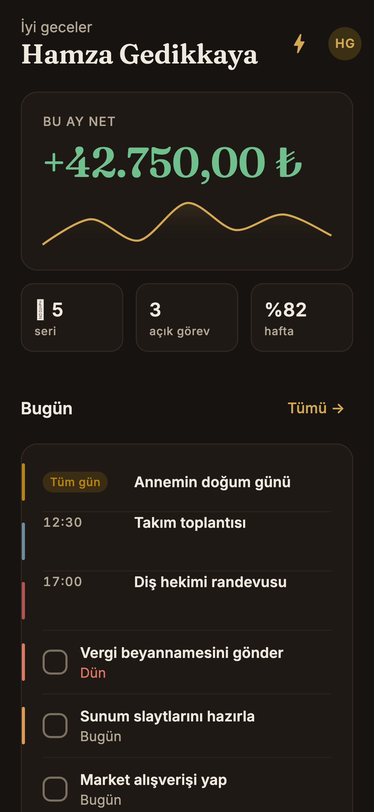
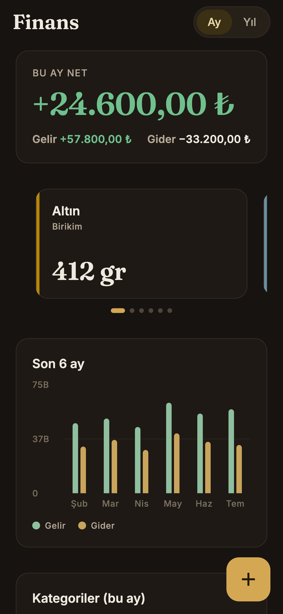
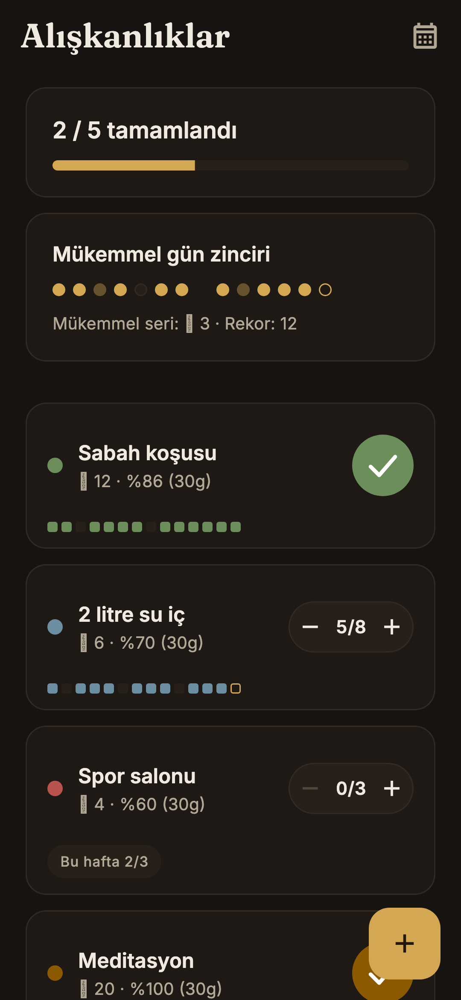
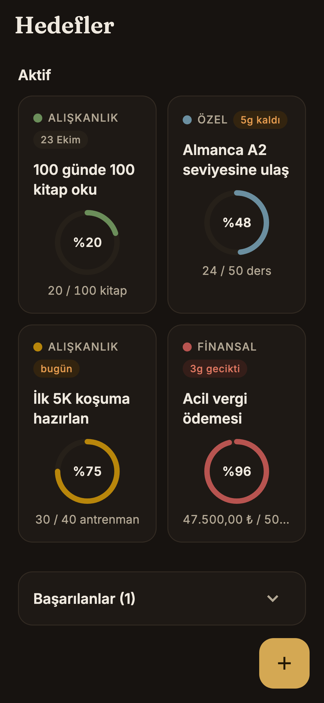
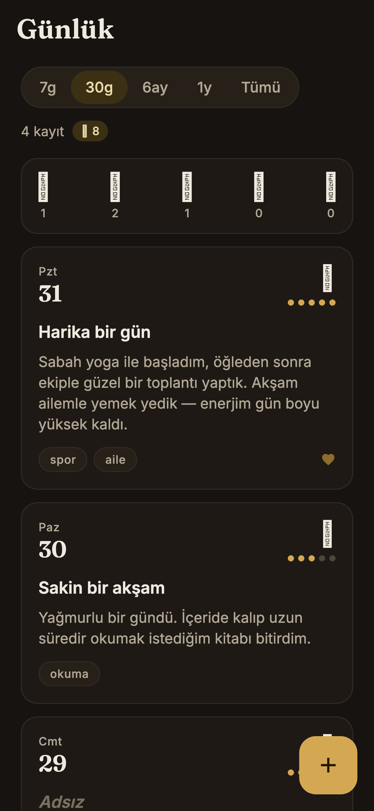
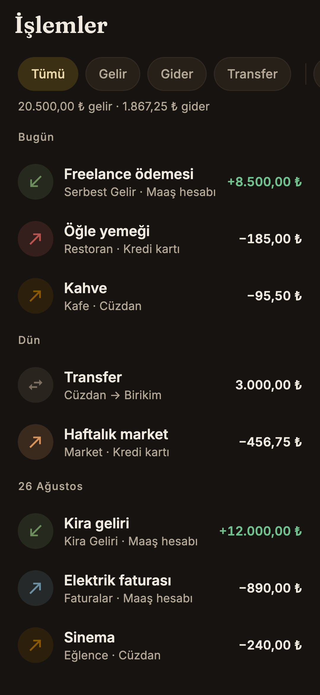
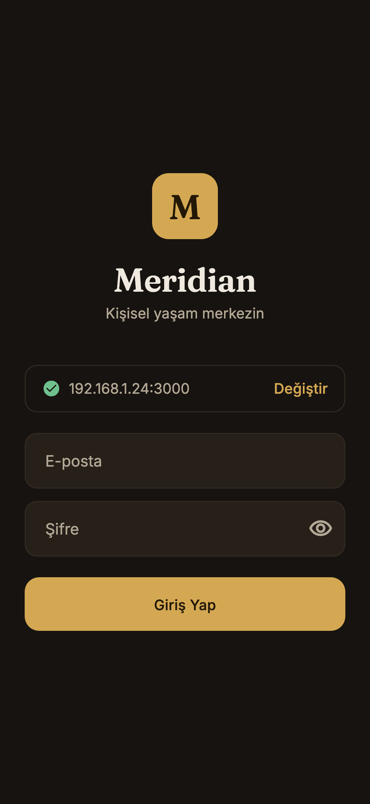
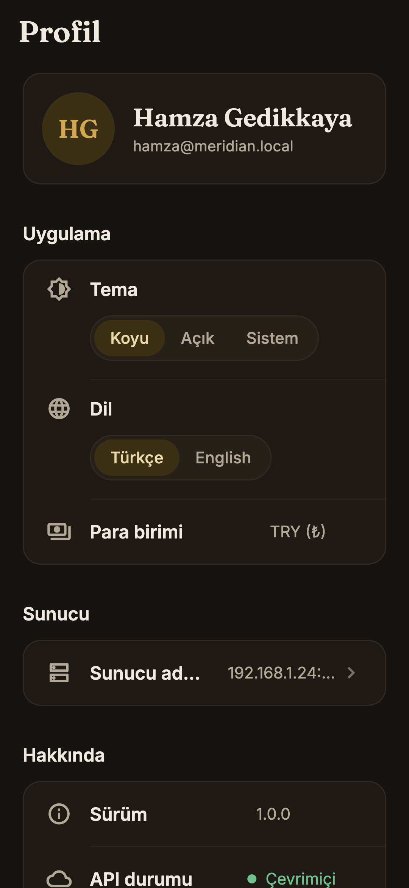

<p align="center"><sub><a href="README.md">English</a> · <b>Türkçe</b></sub></p>

<h1 align="center">
  
  &nbsp;Meridian Mobile
</h1>

<p align="center"><i>Hayatınız, mükemmel bir şekilde düzenlenmiş — artık cebinizde.</i></p>

<p align="center">
  
  
  
  
  
  <a href="https://github.com/hamzagedikkaya/meridian"></a>
  <a href="LICENSE"></a>
</p>

<p align="center">
  <a href="#-%C3%B6ne-%C3%A7%C4%B1kanlar">Öne çıkanlar</a> ·
  <a href="#-h%C4%B1zl%C4%B1-ba%C5%9Flang%C4%B1%C3%A7">Hızlı başlangıç</a> ·
  <a href="#-mimari">Mimari</a> ·
  <a href="#-tasar%C4%B1m-sistemi">Tasarım</a> ·
  <a href="#-api-y%C3%BCzeyi">API</a> ·
  <a href="#-testler">Testler</a>
</p>

---

Meridian Mobile, [**Meridian**](https://github.com/hamzagedikkaya/meridian)'ın — kendi makinende çalışan, local-first kişisel "yaşam OS"unun — Flutter istemcisi. *Senin* Rails sunucunla *senin* Wi-Fi'ın üzerinden konuşur: bulut kiracılığı yok, üçüncü parti analitik yok, açılacak hesap yok. Uygulamayı `http://192.168.1.20:3000` adresine yönlendir, giriş yap; paran, alışkanlıkların, hedeflerin ve günlüğün telefonunda.

Android öncelikli, varsayılanı koyu tema ve tam çift dilli — her ekran **Türkçe ve İngilizce** konuşuyor, uygulama içinden değiştiriliyor ve hesabında saklanıyor. Her sayı tam sayı kuruş değerinden, o para biriminin doğru alt birimiyle ve dilin beklediği yazımla basılır.

<p align="center">
  
  
  
  
</p>

<p align="center"><sub>Golden test harness'ının gerçek çıktıları — gömülü fontlar, gerçekçi fixture'lar, telefon ölçüleri (360×780 @3x). <a href="#-testler">Testler bölümüne bak</a>.</sub></p>

## ✨ Öne Çıkanlar

Beş sekme, her biri bir alan — üstüne push edilen profil katmanı.

### ☀️ Bugün — günün tamamı tek kaydırmada
Saate göre selamlama, altında ayın neti Fraunces display rakamlarıyla ve 7 günlük harcama sparkline'ı. Üç istatistik çipi (seri · açık görev · haftalık alışkanlık oranı), her biri kendi sekmesine derin bağlantı. Bugünün etkinlikleri ve son tarihi bugün olan görevler aynı kartta — öncelik 3dp'lik sessiz bir kenar çubuğu, gecikmiş tarihler kırmızı, görev işaretleme anında animasyonlanıp sonra sunucuyla uzlaşıyor. Altında bugünün alışkanlıkları dokun-tamamla halkalarıyla, sonra ilk üç hedef pace'li ilerleme çubuklarıyla. ⚡ ikonu **hızlı kayıt**'ı açar — tek alan; `−250 kahve` işleme, `habit: koşu` alışkanlık log'una, geri kalan her şey todo'ya gider. Gecikmiş görevler sekmenin kendisinde kırmızı sayı rozeti olarak görünür.

### 💰 Finans — tablo dosyası olmadan para
Ay/Yıl segmentli hero, gelir–gider kırılımıyla. Hesaplar kayıp-oturan bir kart karuseli; her biri kendi para biriminde (`412 gr` gram altın için, `1.234,56 ₺` lira için) ve hesap detayına Hero geçişiyle. Ardından altı aylık gruplu gelir/gider bar grafiği, dokununca alt kategorilere inen kategori donut'ı ve **pace tick**'li bütçe satırları — bugün nerede *olman gerektiğini* gösteren dikey işaret — bütçeyi geçme hızındaysan üstüne ay sonu tahmini satırı. Ekranı yaklaşan abonelikler ve son işlemler kapatır.

**İşlemler** tam akış: yapışkan filtre çipleri (tür · hesap · kategori · tarih aralığı), güne göre gruplanmış başlıklar (`Bugün` / `Dün` / `12 Temmuz`), sonsuz kaydırma, onaylı sola-kaydır-sil ve düzenle/sil içeren detay sayfası. İşlem oluşturma **tutar öncelikli**: özel 4×3 tuş takımıyla sürülen kocaman serif rakam, sonra hesap, kategori, tarih, açıklama — gram altın hesaplarında ondalık tuşu gizli.

### 🔥 Alışkanlıklar — anlamı olan seriler
"2 / 5 tamamlandı" çubuğu, 30 noktalı **mükemmel gün zinciri**, sonra alışkanlık başına bir kart: seri, 30 günlük tamamlanma oranı, 14 günlük zincir şeridi ve ya dokunmalı halka (tek) ya da `− 5/8 +` sayaç pili (çoklu). Toggle'lar iyimser uygulanır, sunucu itiraz ederse snackbar'la geri alınır. Günün son alışkanlığını tamamlamak uygulamanın tek konfetisini tetikler — 12 el-boyaması parçacık, bir kez. Alışkanlık detayı 84 günlük ısı haritası ve arşivleme ekler.

### 🎯 Hedefler — görülebilir ilerleme
İki kolonlu kartlar; animasyonlu ilerleme halkaları, tür üst-başlığı (`FİNANSAL` / `ALIŞKANLIK` / `ÖZEL`) ve renk kodlu son tarih rozetleri (`3g gecikti`, `bugün`, `5g kaldı`). Başarılan hedefler kendi bölümünde katlanır. Detay, halkayı Hero olarak uçurur ve türe uygun paneli gösterir: özel hedeflerde `−10 −1 +1 +10` stepper'ı, alışkanlığa bağlı olanlarda bağlı seri ve gün sayısı, finansal olanlarda bakiyeden yeniden hesaplama.

### 📓 Günlük — yazmak için sakin bir yer
Aralık pili (7g / 30g / 6ay / 1y / Tümü), **dokunarak filtreleyebildiğin** mood dağılımı şeridi, sonra Day One tadında kayıt kartları: Fraunces tarih bloğu, mood emojisi, beş noktayla enerji, etiket pilleri ve minnet işareti. Detay sunucunun zengin metnini render eder. Editör mood check-in'iyle açılır, gövdeye otomatik odaklanır ve 5 saniyede bir taslağı kaydeder.

### 👤 Profil — senin ve sunucunun
Tema (koyu / açık / sistem), **dil (Türkçe / English)**, para birimi, canlı API durumu, uygulama sürümü — ve `/health`'i pingleyip `✓ Bağlandı · Meridian v1.0.0 · 38 ms` raporlayan ayrı bir **sunucu sayfası**. Ulaşılamayan bir adresi kaydetmek onay ister. Çıkış, token'ı ve hesap durumunu siler; sunucu adresi, dil ve tema kalır, böylece giriş ekranı hâlâ senin ayarlarınla açılır.

<p align="center">
  
  
  
  
</p>

<p align="center"><sub>Günlük · İşlemler · Giriş · Profil</sub></p>

### Her ekranda geçerli davranışlar
| | |
|---|---|
| **Baştan sona çift dil** | İki tipli metin sınıfı (`lib/l10n/`), analyzer'ın zorunlu tuttuğu soyut bir sözleşme ve Profil'de uygulamayı anında yeniden çizen bir anahtar. Seçim hem cihazda saklanır hem hesaba yazılır; web uygulaması ve yeni kurulum onu izler. Varsayılan Türkçe; ilk açılışta telefonun dili ikisinden biriyse o kullanılır. |
| **Dile uygun sayılar** | Türkçede `%82`, İngilizcede `82%`. `1.234,56 ₺` ile `1,234.56 ₺`. Grafik ekseninde `75B` ile `75K`. `27 Ağustos` ile `August 27`. Tek bir `Intl.defaultLocale`, yerelleştirme delegate'i tarafından senkron tutulur. |
| **Çevrimdışı dürüstlüğü** | Başarısız yenileme, son iyi veriyi ekranda tutar: hairline bir banner — `Çevrimdışı · son güncelleme 12:40` ve tekrar dene. Tam ekran hata durumu yalnızca gösterilecek hiçbir şey yoksa çıkar. |
| **İyimser yazmalar** | İşaretleme, sayaç ve silme önce arayüzü günceller, sonra uzlaşır; hata olursa snackbar'la geri alınır. |
| **Spinner değil skeleton** | Her ekranın kendi geometrisini taklit eden bir kemik düzeni var, içeriğe cross-fade ile geçer. Hiçbir yerde bloklayan dialog yok. |
| **Para tek bir yerde** | Tam sayı `*_cents` + para birimi başına `subunit_to_unit`, tek bir fonksiyonda biçimlenir. Gram altının (`GAU`) alt birimi 1 olduğu için `412 gr` basar — asla `4,12` değil. |
| **Sadece renk değil, işaret** | Gelir yeşil `+`, gider varsayılan mürekkep renginde `−`. Asla yalnızca renkle değil — kırmızı bir duvar tedirgin eder ve renk körlüğünde renk tek başına çalışmaz. |
| **Hata bir sebep taşır, cümle değil** | API katmanı tipli bir `ApiErrorKind` fırlatır; arayüz onu aktif dildeki metne çevirir. Sunucu doğrulama mesajları olduğu gibi gösterilir — Rails onları kullanıcı diline göre zaten yerelleştiriyor. |
| **Haptik** | Dört seviyeli harita: seçimde tick, başarıda hafif, kutlamada orta, yıkıcı onayda ağır. Web'de sessizce devre dışı. |

## 🧰 Teknoloji

| Katman | Seçim |
|---|---|
| Framework | Flutter 3.44 · Dart 3.12 (Material 3) |
| Durum | `flutter_riverpod` ^3.3.2 — codegen yok; son iyi değeri koruyan `AsyncValue` |
| Yönlendirme | `go_router` ^17.3.0 — `StatefulShellRoute.indexedStack`, 5 branch, kök seviyede modal route'lar |
| Ağ | `dio` ^5.10.0 — Bearer interceptor, `401` → çıkış, tüm hatalar tek `ApiException`a normalize |
| Yerelleştirme | tipli metin sınıfları + bir `LocalizationsDelegate` (`.arb` yok, codegen yok) · `flutter_localizations` |
| Depolama | `flutter_secure_storage` ^10.3.1 (token) · `shared_preferences` ^2.5.5 (sunucu adresi, dil, tema, taslaklar) |
| Grafik | `fl_chart` ^1.2.0 — donut, sparkline, gruplu altı ay barları |
| Hareket | `animations` ^2.2.0 (fade-through) · `flutter_animate` ^4.5.2 (yalnızca giriş stagger'ları) |
| Yükleme | `skeletonizer` ^2.1.3 |
| Zengin metin | `flutter_widget_from_html_core` ^0.17.2 — günlük `body_html` |
| Biçimleme | `intl` ^0.20.2 — dile göre para, tarih ve ay adları |
| Tipografi | Fraunces + Inter, `assets/fonts/` altında `.ttf` olarak gömülü — çalışma anında font indirme yok |
| Kalite | `flutter_lints` ^6.0.0 · `flutter_test` · `matchesGoldenFile` |

## 🚀 Hızlı Başlangıç

**Gereksinimler** — Flutter 3.44+ stable (Dart 3.12+), cihaz build'i için API 26+ Android SDK ve `/api/v1`'i sunan çalışan bir [Meridian](https://github.com/hamzagedikkaya/meridian) sunucusu.

```bash
git clone https://github.com/hamzagedikkaya/meridian-mobile.git
cd meridian-mobile
flutter pub get
flutter run                 # Android cihaz veya emülatör
```

Tarayıcıda düzen/veri önizlemesi için:

```bash
flutter run -d chrome --web-browser-flag=--disable-web-security
```

> Meridian sunucusunda CORS middleware'i yok, bu yüzden tarayıcı önizlemesi bu flag'i (ya da yalnızca geliştirme için bir `rack-cors`) gerektirir. Native build'ler etkilenmez.

### Sunucuna bağlanmak

Giriş ekranındaki adres alanı makul bir varsayılanla dolar ve son seçimini hatırlar:

| Nerede çalıştırıyorsan | Ön-dolu adres |
|---|---|
| Chrome (web önizleme) | `http://localhost:3000` |
| Android emülatör | `http://10.0.2.2:3000` |
| Fiziksel cihaz | son kullanılan — makinenin LAN IP'sini gir, örn. `http://192.168.1.20:3000` |

Adresi yaz, ✓ işaretini bekle, sonra herhangi bir Meridian kullanıcısıyla giriş yap — sunucunun seed'i `demo@meridian.local` / `demo12345` oluşturur. Health ping'i başarılı olana kadar kimlik bölümü soluk kalır; böylece yanlış bir adres asla yanlış şifre gibi görünmez.

LAN sunucusuna cleartext `http://` erişimi **debug** manifest'indeki `network_security_config.xml` ile açık; release APK için bu yapılandırmanın ana manifest'e taşınması (ya da HTTPS) gerekir.

### Günlük komutlar

```bash
flutter analyze                                          # statik analiz — şu an temiz
flutter test                                             # unit + widget kümeleri
flutter test --run-skipped test/golden                   # ekran görüntülerini karşılaştır
flutter test --run-skipped --update-goldens test/golden  # iki seti de yenile
flutter build apk --release                              # sideload'lanabilir APK
```

## 🧱 Mimari

```
lib/
├─ main.dart          ProviderScope + MaterialApp.router, tüm intl locale'leri yüklü
├─ core/              api.dart          dio factory, Bearer interceptor, ApiErrorKind
│                     session.dart      token deposu, sunucu adresi, oturum makinesi, /health
│                     locale_mode.dart  arayüz dili: cihaz seçimi → hesap → telefon → tr
│                     theme_mode.dart   koyu/açık/sistem, aynı sırayla çözülür
│                     formats.dart      para, tarih, ondalık — yalnızca değer biçimleme
│                     haptics.dart      dört seviyeli haptik haritası
├─ l10n/              app_l10n.dart     soyut sözleşme + delegate + context.l10n
│                     app_l10n_tr.dart · app_l10n_en.dart   dil başına bir sınıf
├─ models/            değişmez modeller, yalnızca fromJson — alan başına bir dosya
├─ data/              repository.dart   endpoint başına bir async metot
│                     providers.dart    Riverpod provider'ları → AsyncValue<Fetched<T>>
├─ theme/             app_colors.dart   Noktürn token'ları ThemeExtension olarak (koyu + açık)
│                     app_typography.dart · app_theme.dart
├─ router/            app_router.dart   shell branch'leri, oturum yönlendirmesi, fade-through
└─ ui/
   ├─ widgets/        yirmi dört paylaşılan parça: NokturnCard, NokturnRow, MoneyText,
   │                  ProgressRing, PacedProgressBar, AmountKeypad, PickerSheet…
   └─ screens/        today · finance · habits · goals · journal · profile · shell
                      (+ login, splash) — her biri kendi widgets/ klasörüyle
```

Rotalar klasörleri birebir yansıtır — `/today`, `/finance`, `/finance/transactions`, `/habits`, `/goals/:id`, `/journal/:id`, `/profile/server` — böylece kod tek dilde kalırken arayüz iki dil konuşur.

**Yerelleştirme.** `AppL10n`, her metin için bir üye taşıyan soyut bir sınıf; `AppL10nTr` ve `AppL10nEn` onu implemente eder. Yalnızca tek dilde yazılmış bir metin derlenmez — bütün mesele bu: bir boşluğu sessizce gizleyecek çalışma-anı fallback'i yok. API değerleri (`mood`, `account_type`, `frequency`) saklanan metin yerine küçük `switch` metotlarıyla eşlenir; delegate `Intl.defaultLocale`'i senkron tutar, böylece `core/formats.dart` sayı ve tarihleri ağaç boyunca locale taşımadan aktif dile göre biçimler.

**Okuma yolu.** Ekran bir provider'ı izler, o repository'ye sorar, o da dio'yu çağırır. Provider'lar `Fetched<T>` döner — veri artı geldiği an — ve Riverpod 3 başarısız bir yenilemede önceki değeri korur. Böylece render kuralı her yerde aynı: varsa `.value`'yu çiz, `hasValue && hasError` olduğunda çevrimdışı banner'ını ekle, hiçbir şey yoksa tam ekran boş durumu göster. Önbellek oturum başına ve bellekte; diske hiçbir şey yazılmıyor.

**Yazma yolu.** Ekranlar repository'yi doğrudan çağırır, etkileşimi anında hissettirecek yerlerde yerel durumu iyimser günceller, sonra ilgili provider'ı invalidate eder. İşlemler akışı, değişmez bir `TxFilters` kaydıyla anahtarlanan bir `AsyncNotifier` — bu yüzden akış ve hesap detayı durum paylaşmadan yan yana sayfalayabilir; silme işlemi de akışı sıfırlamak yerine toplamları yerel olarak düzeltir.

**Oturum.** Splash kapısı token'ı okur, iyimser yönlendirir ve arka planda `/me`'yi yoklar; herhangi bir yerden gelen `401` dio interceptor'ını tetikler, token'ı siler ve bir uyarıyla girişe atar. `go_router` yönlendirmesini üç durumlu bir oturum makinesi sürer (`unknown` → `loggedOut` / `loggedIn`), yani nereye düşeceğine karar veren tam olarak tek bir yer var.

## 🎨 Tasarım Sistemi

Görsel dil **Noktürn** — sıcak-koyu özel bankacılık ile Day One'ın kesişimi. Derin espresso siyahları (asla saf `#000` değil), vurgu ve birincil aksiyonlara ayrılmış tek bir disiplinli altın, hero sayılar için serif display tipografi. Her token ve ekran dahil tam şartname: [`docs/design.md`](docs/design.md).

<p align="center">
  
  
  
  
  
  
  
</p>

- **Renk** — tema başına 26 isimli token, `ThemeExtension` olarak sunulur ve `context.nok` ile okunur. Altın asla "iyi" ya da "kötü" demez; "senin" der. Yeşil ve kırmızı sıkı sıkıya semantik kalır, altını değerli tutan da bu.
- **Yükseklik** — gölge değil, yüzey basamakları ve 1dp hairline'lar. `bg` → `surface1` (kartlar) → `surface2` (nav, input, çip) → `surface3` (sheet, dialog).
- **Tipografi** — display ve başlıklarda Fraunces 600, geri kalan her şeyde Inter. Tüm tutarlar tabular figür kullanır; iki dilde de kolonlar oynamaz.
- **Hareket** — varsayılan 350ms `easeOutCubic`, spring yok. Sekmeler arası fade-through, oluştur/düzenle modalleri için 400ms slide-up, tüm uygulamada tam olarak iki Hero uçuşu ve bilinçli tek bir overshoot: işaretleme pop'u. Hero sayılar ilk yüklemede sayarak artar, yenilemede cross-fade olur — sayılarını yeniden animasyonlayan bir yenileme, neyin değiştiği konusunda yalan söylüyor demektir.
- **Açık tema** — sıcak kâğıt üzerine tam bir ikinci palet; AA kontrastı tutması için altın `#96731D`'ye koyulaştırılmış.

## 🔌 API Yüzeyi

Tüm endpoint'ler `/api/v1` altında, `Authorization: Bearer <api_token>` ile kimliklenir. Para her zaman tam sayı `*_cents` olarak, para biriminin `subunit_to_unit` değeriyle birlikte gider.

| Endpoint | Neyi besler |
|---|---|
| `GET /health` | giriş ping'i ve sunucu ayarları testi (kimliksiz; gecikmeyi istemci kendi ölçer) |
| `POST /session` · `GET /me` | giriş, token geçerlilik yoklaması, görünen ad ve tercihler |
| `PATCH /me` | telefonda seçilen dil ve tema, hesaba yazılır |
| `GET /home` | tüm Bugün ekranı tek istekte |
| `GET /finance/dashboard` · `GET /accounts` | Finans: net, altı ay serisi, kategori pastası, bütçeler, abonelikler, son işlemler |
| `GET/POST/PATCH/DELETE /transactions` · `GET /finance_categories` | işlem akışı, filtreler, oluştur/düzenle/sil |
| `GET /habits` · `PATCH /habits/:id/toggle_today` · `archive` | alışkanlık kartları, zincirler, mükemmel gün şeridi, iyimser toggle'lar |
| `GET /goals` · `PATCH /goals/:id/update_progress` · `recalculate` | hedef kartları, halkalar, türe özgü aksiyonlar |
| `GET/POST/PATCH/DELETE /journal_entries` | günlük listesi, detay (`body_html`), editör |
| `GET /todos` · `PATCH /todos/:id/toggle` · `GET /events` | Bugün'ün gün kartı ve görev sayfası |
| `POST /quick_captures` | ⚡ tek alanlı yönlendirici |

Hata sözleşmesi: `401 {error}` → çıkış · `404 {error}` → kayıt bulunamadı · `422 {errors: {alan: [mesaj]}}` → alan altı hataları. Geri kalan her şey aktif dilde bir insan cümlesine dönüşür ve ağ hatası neye bakılacağını söyler: *"Sunucuya ulaşılamıyor — aynı Wi-Fi ağında olduğundan emin ol."*

## 🧪 Testler

```bash
flutter analyze                          # sorun yok
flutter test                             # 53 test, golden kümesi atlanır
flutter test --run-skipped test/golden   # 16 ekran görüntüsü, iki dilde
```

| Test kümesi | Kapsadığı |
|---|---|
| [`test/models_test.dart`](test/models_test.dart) | her payload şekli → model; null'lar, zarflar ve çoklu para birimli hesaplar dahil |
| [`test/formats_test.dart`](test/formats_test.dart) | para ve tarih biçimleme: TRY, USD ve gram altının alt-birim-1 kuralı |
| [`test/l10n_test.dart`](test/l10n_test.dart) | yerelleştirme katmanı: locale çözümü, yüzde işaretinin yeri, dile göre gruplama ve ay sırası, göreli günler, API değer eşlemeleri ve iki dilde hata sözleşmesi |
| [`test/screens/`](test/screens/) | ekran başına widget smoke testleri, provider override'larıyla — dolu *ve* boş durumlar, artı uygulamayı çalışırken İngilizceye geçirme |
| [`test/golden/`](test/golden/) | sekiz ekranın tamamı 360×780 @3x'te **iki dilde**, gerçek gömülü fontlar ve çevrilmiş fixture'larla |

Golden kümesi bir **görsel inceleme aracı**, geçti/kaldı kapısı değil. Fixture'ları "şimdi"ye göreli (`Bugün`, `Dün`, `5g kaldı`) — ekranlar canlı bir telefon gibi görünsün diye; bu da saat ilerledikçe görüntülerin kaymasına yol açar. Bu yüzden `golden` etiketli ve varsayılan koşuda atlanıyor (`dart_test.yaml`), böylece `flutter test` deterministik kalıyor; bilinçli olarak `--run-skipped` ile çalıştır, `--update-goldens` ile tazele. Verisi de arayüzle birlikte çevrilir; `images/en/` bir İngiliz kullanıcının telefonu gibi okunur, Türkçe içeriğin üstüne geçirilmiş İngilizce bir kabuk gibi değil. Emoji glyph'leri test renderer'ında kutuya düşer — cihazda normal görünürler.

## 🗺 Yol Haritası

Tamamlanan: beş sekme, uygulama içi anahtarla Türkçe/İngilizce arayüz, işlem oluştur/düzenle/sil, alışkanlık ve hedef yazmaları, günlük editörü, hızlı kayıt, profil ve sunucu ayarları.

Henüz yok:

- **Hesap oluşturma/düzenleme** — Finans ekranı "yakında" diyor ve gerçekten öyle
- **Ayrı Görevler ve Ajanda sayfaları** — görevler Bugün'ün sayfasından okunup işaretleniyor, etkinlikler salt okunur
- **Yalnızca web'de olan modüller** — takvim, insights, haftalık review, yedekler ve global arama şimdilik Rails uygulamasında
- **Release sertleştirmesi** — cleartext HTTP yapılandırması yalnızca debug'da, launcher ikonu ve splash hâlâ Flutter varsayılanı, CI workflow'u yok
- **Disk önbelleği** — son iyi veri oturum başına bellekte; sunucusuz soğuk açılış boş durumu gösterir

## 📄 Lisans

Meridian Mobile, Meridian projesinin parçasıdır ve sunucuyla aynı koşullarla — [**PolyForm Noncommercial License 1.0.0**](LICENSE) — dağıtılır. Kişisel, akademik ve eğitim amaçlı kullanım serbesttir; ticari kullanım bu lisansla verilmez. Farklı bir anlaşma istiyorsan issue açabilirsin.

---

<p align="center"><sub>Meridian Mobile — hayatınız mükemmel bir şekilde düzenlenmiş, kendi ağınızda.</sub></p>
